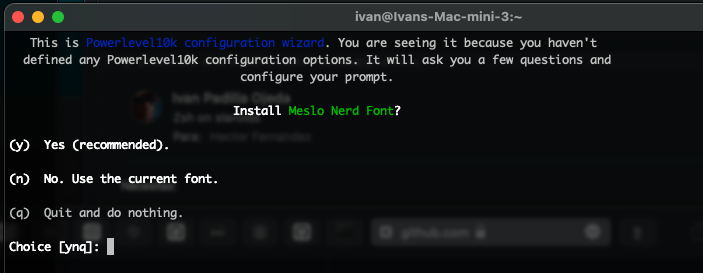
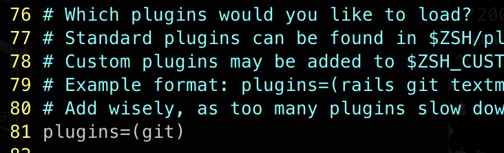
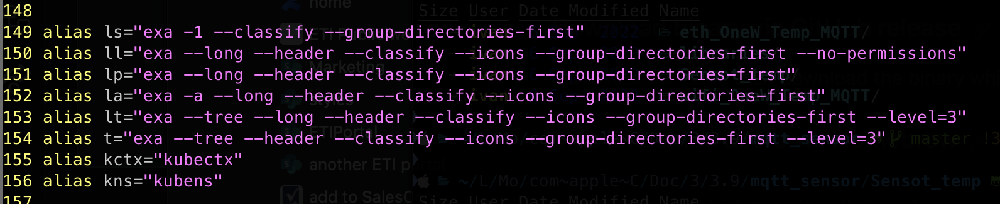

- [1. Tools](#1-tools)
  - [1.1. iTerm2](#11-iterm2)
  - [1.2. Homebrew](#12-homebrew)
  - [1.3. K9S](#13-k9s)
  - [1.4. Xcode (OPTIONAL - not initially needed)](#14-xcode-optional---not-initially-needed)
- [2. CLI enhancements](#2-cli-enhancements)
  - [2.1. Framework](#21-framework)
  - [2.2. P10k](#22-p10k)
  - [2.3. Plugins](#23-plugins)
    - [2.3.1. Kubectl](#231-kubectl)
    - [2.3.2. zsh-autosuggestions](#232-zsh-autosuggestions)
    - [2.3.3. zsh-syntax-highlighting](#233-zsh-syntax-highlighting)
  - [2.4. Other](#24-other)
    - [2.4.1. kubecolor](#241-kubecolor)
    - [2.4.2. Autojump](#242-autojump)
    - [2.4.3. Exa](#243-exa)


# 1. Tools

## 1.1. iTerm2
I guess you are already using iTerm2. If you are not, start by installing it [iterm2.com](https://iterm2.com) and use that instead of terminal.

## 1.2. Homebrew
Also another tool that we will need in the journey is homebrew ([brew.sh](https://brew.sh)). If you dont already have it, just install it by:

```
    /bin/bash -c "$(curl -fsSL https://raw.githubusercontent.com/Homebrew/install/HEAD/install.sh)"
```

after the installer is done, you need to execute a couple of lines to add it to your path (replace with your current username in the first one)

```(shell)
    (echo; echo 'eval "$(/usr/local/bin/brew shellenv)"') >> /Users/szigeti/.zprofile

    eval "$(/usr/local/bin/brew shellenv)"
```

## 1.3. K9S

The best CLI kubernetes explorer. Install it also with Homebrew:
```
    brew install derailed/k9s/k9s
```
Documentation is [here](https://k9scli.io/topics/commands/)


## 1.4. Xcode (OPTIONAL - not initially needed)
A third tool to keep in consideration are Apple Xcode tools. Do:

```(shell)
    sudo rm -rf /Library/Developer/CommandLineTools

    sudo xcode-select --install
```
...and accept the license pop-up. 

# 2. CLI enhancements 
## 2.1. Framework

Next thing to consider is the installation of a framework. Here we chose [OhMyZsh](https://github.com/ohmyzsh/ohmyzsh). Execute the following:

```
    sh -c "$(curl -fsSL https://raw.githubusercontent.com/ohmyzsh/ohmyzsh/master/tools/install.sh)"
```
<p align="center">

</p>

## 2.2. P10k
Now let's add some customization to the prompt with powerlevel10k [P10k](https://github.com/romkatv/powerlevel10k#meslo-nerd-font-patched-for-powerlevel10k). If you just run:

```
    brew install powerlevel10k

    echo "source $(brew --prefix)/share/powerlevel10k/powerlevel10k.zsh-theme" >>~/.zshrc
```
... and then close the terminal window and open a new one, and follow the on screen menu for customising the prompt to match your likes. It will be important later on, to show the cluster and namespace in which you are working. You can always use defaults if you dont have a personal preference on something. Usually first line is the typical choice.

<p align="center">

</p>

## 2.3. Plugins
Lets add some plugins to make typing easier. They are all [here](https://github.com/ohmyzsh/ohmyzsh/tree/master/plugins), but there is a minimum set recommended.

You can enable the ones you need by editing the  ```~/.zshrc``` file:

```
  vim ~/.zshrc
```
Locate the plugin section, usually like this:

<p align="center">

</p>

These are the ones I've enabled:
```
    plugins=(git
            docker
            docker-compose
            kubectl
            zsh-autosuggestions
            zsh-syntax-highlighting
            zsh-navigation-tools
            copypath
            copyfile
            copybuffer
        )
```
Most of them are already inside the plugin directory of your Oh-My-Zsh ($HOME/.oh-my-zsh/plugins/), but some of them need to be downloaded. I'll detail them bellow in a particular section for each.

As a referenceI'm attaching here my full [~/.zshrc](./zshrc)
### 2.3.1. Kubectl

Kubectl autocompletion. This [plugin](https://github.com/ohmyzsh/ohmyzsh/tree/master/plugins/kubectl#kubectl-plugin) is already downloaded. You just need to enable it on the ~/.zshrc

It gives you a nice set of alias that you can use to shorten your calls to 'kubectl' commands: 

|Alias|Command|
|---|---|
|kaf ... |-> kubectl apply -f ...|
|kgpo    |-> kubectl get pods|
...
all the available aliases are listed [here](https://github.com/ohmyzsh/ohmyzsh/tree/master/plugins/kubectl#kubectl-plugin)

### 2.3.2. zsh-autosuggestions

 You need to download this [plugin](https://github.com/zsh-users/zsh-autosuggestions/blob/master/INSTALL.md#oh-my-zsh) and also declare it in the plugin section of the ~/.zshrc. Download it with:

```
    git clone https://github.com/zsh-users/zsh-autosuggestions ${ZSH_CUSTOM:-~/.oh-my-zsh/custom}/plugins/zsh-autosuggestions
```
### 2.3.3. zsh-syntax-highlighting

Declare the [plugin](https://github.com/zsh-users/zsh-syntax-highlighting/blob/master/INSTALL.md) on your ```~./zshrc``` and exec this also to download it:

```
    git clone https://github.com/zsh-users/zsh-syntax-highlighting.git ${ZSH_CUSTOM:-~/.oh-my-zsh/custom}/plugins/zsh-syntax-highlighting
```

## 2.4. Other
### 2.4.1. kubecolor

Install [this](https://github.com/hidetatz/kubecolor) tool with homebrew:

```
    brew install hidetatz/tap/kubecolor
```

and add this at the end of your .zshrc

```
    # get zsh complete kubectl
    source <(kubectl completion zsh)
    alias kubectl=kubecolor
    # make completion work with kubecolor
    compdef kubecolor=kubectl
```

I have several alias in my ~/.zshrc that make my life easier:

<p align="center">

</p>

### 2.4.2. Autojump

Very useful [tool](https://github.com/wting/autojump#installation), that allows you to jump directly into the directory of your project just using its name.

``` 
    brew install autojump
```

That also install a wrapper ```j```, so I do very often things like ``` 'j thisProject' ``` 


### 2.4.3. Exa

Good replacement for 'ls', you can see the alias in the previous picture in my ~/.zshrc. The tool can be found [here](https://github.com/ogham/exa), but you can install it directly with homebrew with:

```
    brew install exa
```
See some examples of the use [here](https://the.exa.website). Actually when you add some alias, you dont have to do anything special for using it, it is called everytime you do an ```'ls'```. These are my alias for it on my ```~/.zshrc``` file:

```
  la='exa -a --long --header --classify --icons --group-directories-first'
  ll='exa --long --header --classify --icons --group-directories-first --no-permissions'
  lp='exa --long --header --classify --icons --group-directories-first'
  ls='exa -1 --classify --group-directories-first'
  lt='exa --tree --long --header --classify --icons --group-directories-first --level=3'
  t='exa --tree --header --classify --icons --group-directories-first --level=3'
```


