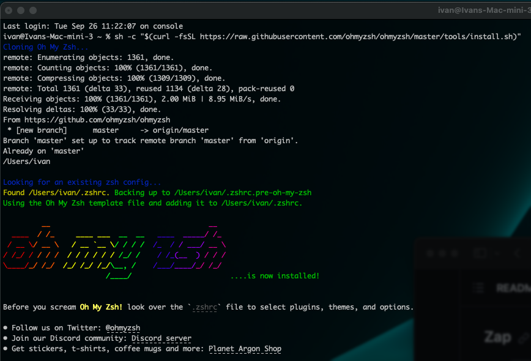

# Tools

## iTerm2
I guess you are already using iTerm2. If you are not, start by installing it [iterm2.com](https://iterm2.com) and use that instead of terminal.

## Homebrew
Also another tool that we will need in the journey is homebrew ([brew.sh](https://brew.sh)). If you dont already have it, just install it by:

```
/bin/bash -c "$(curl -fsSL https://raw.githubusercontent.com/Homebrew/install/HEAD/install.sh)"
```

after the installed is done, you need to execute a couple of lines to add it to your path:

```
(echo; echo 'eval "$(/usr/local/bin/brew shellenv)"') >> /Users/ivan/.zprofile

eval "$(/usr/local/bin/brew shellenv)"
```
## Xcode
A third tool to keep in consideration are Apple Xcode tools. Do:

```
sudo rm -rf /Library/Developer/CommandLineTools

sudo xcode-select --install
```
...and accept the license pop-up.

# CLI enhancements 
## Framework

Next thing to consider is the installation of a framework. Here we chose [OhMyZsh](https://github.com/ohmyzsh/ohmyzsh). Execute the following:

```
sh -c "$(curl -fsSL https://raw.githubusercontent.com/ohmyzsh/ohmyzsh/master/tools/install.sh)"
```



## P10k
Now let's add some customization to the prompt with powerlevel10k [P10k](https://github.com/romkatv/powerlevel10k#meslo-nerd-font-patched-for-powerlevel10k). If you just run:

```
brew install powerlevel10k

echo "source $(brew --prefix)/share/powerlevel10k/powerlevel10k.zsh-theme" >>~/.zshrc
```
... and then close the terminal window and open a new one, and follow the on screen menu for customising the prompt to match your likes. It will be important later on to indicate the cluster and namespace in which you are working. You can always use defaults if you dont have a personal preference on something. Usually first line is the typical choice.


## Plugins
Lets add some plugins to make typing easier. They are all [here](https://github.com/ohmyzsh/ohmyzsh/tree/master/plugins), but there is a minimum set recommended.

You can enable the ones you need by editing the  ```~/.zshrc``` file:

```
vim .zshrc
```
Locate the plugin section, usually like this:


These are the ones I've enabled:
```
plugins=(git
        docker
        docker-compose
        kubectl
        zsh-autosuggestions
        zsh-syntax-highlighting
        zsh-navigation-tools
        copypath
        copyfile
        copybuffer
    )
```
Most of them are already inside the plugin directory of your Oh-My-Zsh ($HOME/.oh-my-zsh/plugins/), but some of them need to be downloaded. I'll detail them bellow
### Kubectl

Kubectl autocompletion. This [plugin](https://github.com/ohmyzsh/ohmyzsh/tree/master/plugins/kubectl#kubectl-plugin) is already downloaded. You just need to enable it on the ~/.zshrc

### zsh-autosuggestions

Appart from declaring it on the plugin section of the ~/.zshrc, you need to download it with:

```
git clone https://github.com/zsh-users/zsh-autosuggestions ${ZSH_CUSTOM:-~/.oh-my-zsh/custom}/plugins/zsh-autosuggestions
```
### zsh-syntax-highlighting

Declare it on your ~./zshrc and exec this also to download it:

```
git clone https://github.com/zsh-users/zsh-syntax-highlighting.git ${ZSH_CUSTOM:-~/.oh-my-zsh/custom}/plugins/zsh-syntax-highlighting
```

## Other
### kubecolor

Install it with homebrew 

```
brew install hidetatz/tap/kubecolor
```

and add an alias at the end of your .zshrc

```
alias kubectl="kubecolor"
```

I have several alias in my ~/.zshrc that make my life easier:


### Exa

Good replacement for 'ls', you can see the alias in the previous picture in my ~/.zshrc. It is [here](https://github.com/ogham/exa), but you can install it directly with homebrew:

```
brew install exa
```

## K9S

The best CLI kubernetes explorer. Install it also with Homebrew:
```
brew install derailed/k9s/k9s
```
Documentation is [here](https://k9scli.io/topics/commands/)

